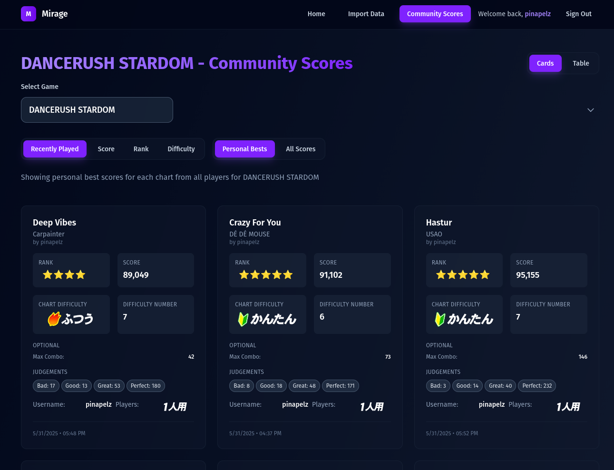
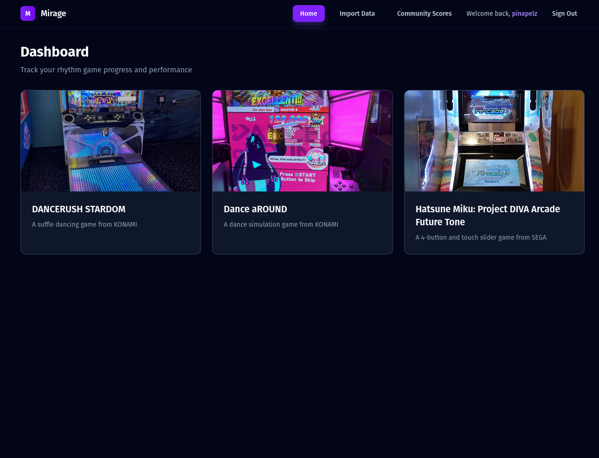

# Mirage

**Mirage** is a rhythm game score tracker that doesn’t rely on predefined seeds or chart metadata. It preseves your scores across games — even niche ones.




# ✨ Features
- **Import & Track Scores** – Keep a safe backup of your game scores.
- **Add Any Game** – Works with any rhythm game, even without official metadata.
- **Self-Host or Go Solo** – Use locally or host for group score tracking. Multi-user system.
- **Presets** - Comes pre-loaded with tracking functionality for various rhythm games

> ⚠️ **Warning:** Work in progress

# Development
Install dependencies:
```bash
pnpm install:all1
```

Create a `.env` file in `backend` based on `backend/.env.template`. Fill in the fields as required.

Setup and Initialize Database:
```bash
pnpm db-init
```

Create a `.env` file in `frontend` based on `frontend/.env.template`
- If you did not change the port of the API in the backend env file. Then your `VITE_API_URL` is `http://localhost:5000/api`

Start Frontend and Backend
```bash
pnpm dev
```

## Stack
- React Typescript
- Express
- Prisma ORM
- Postgres
